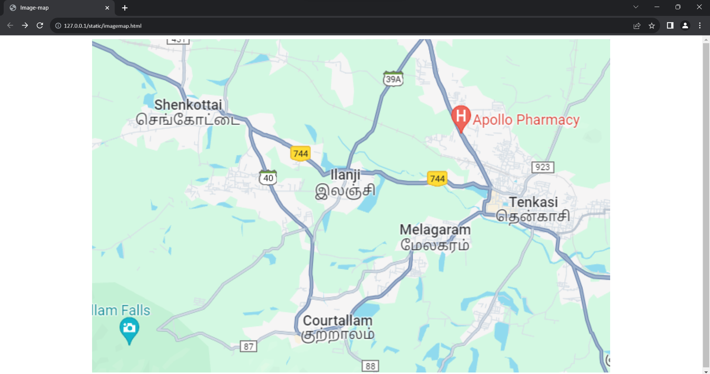

# Places Around Me
## AIM:
To develop a website to display details about the places around my house.

## Design Steps:

### Step 1:
First clone the repository by the given link.
### Step 2:
Make changes in approriate files.
### Step 3:
Create static folder inside the static create html folder inside it.
Create html files that contain code related to map.

## Code:
<!DOCTYPE html>
<head>
    <title>Image-map</title>
</head>
<body>
    

    
    <map name="img">
        <area shape="rect" coords="53,57,193,116" href="https://www.google.com/maps/place/Shenkottai,+Tamil+Nadu+627809/@8.9731292,77.2354064,15z/data=!3m1!4b1!4m6!3m5!1s0x3b06810e54a796f5:0x7daa844824a5d448!8m2!3d8.9751131!4d77.2491365!16zL20vMGY2OGto?entry=ttu" alt="Shencottai">
        <area shape="rect" coords="507,192,616,241" href="https://www.google.com/maps/place/Tenkasi,+Tamil+Nadu/@8.9640581,77.2938787,14z/data=!3m1!4b1!4m6!3m5!1s0x3b0429c15ac547f7:0x9a707276cd8ae327!8m2!3d8.9564008!4d77.3152492!16zL20vMDRkd3Q4?entry=ttu" alt="Tenkasi">
        <area shape="rect" coords="260,340,367,388" href="https://www.google.com/maps/place/Courtallam,+Tamil+Nadu/@8.9318814,77.2608223,14z/data=!3m1!4b1!4m6!3m5!1s0x3b042a2dd855fc63:0x585150bdffcf2f74!8m2!3d8.9341102!4d77.277938!16zL20vMDZnamp6?entry=ttu" alt="Courtallam">
        <area shape="rect" coords="278,154,366,208" href="https://www.google.com/maps/place/Ilanji,+Tamil+Nadu+627805/@8.9619241,77.2748452,16z/data=!3m1!4b1!4m15!1m8!3m7!1s0x3b0429c15ac547f7:0x9a707276cd8ae327!2sTenkasi,+Tamil+Nadu!3b1!8m2!3d8.9564008!4d77.3152492!16zL20vMDRkd3Q4!3m5!1s0x3b042a04cd86d4b3:0xebb3e2363039d0f9!8m2!3d8.9612903!4d77.2793059!16zL20vMGY0Xzlz?entry=ttu" alt="Ilanji">
    </map>
</body>
</html>

## Output:

## Result:
Image-maps has been created successfully
